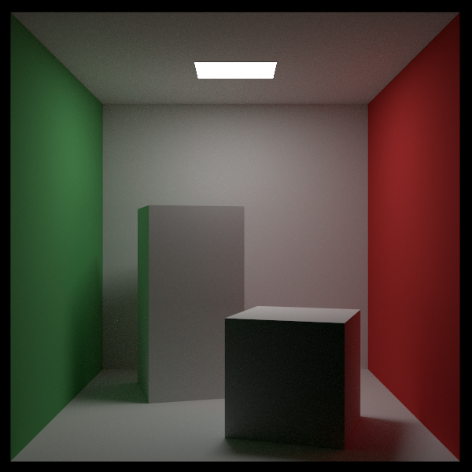
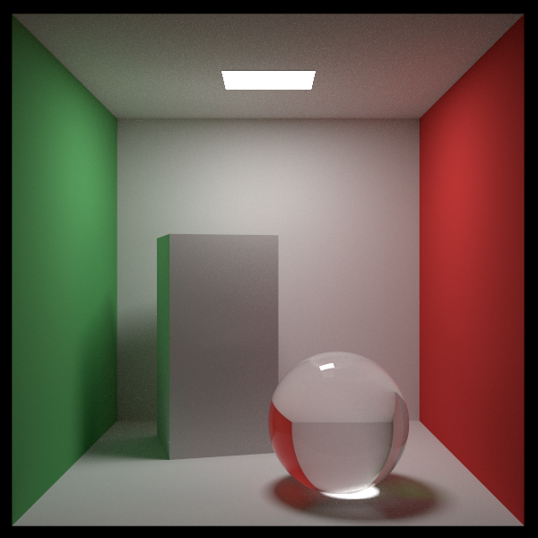
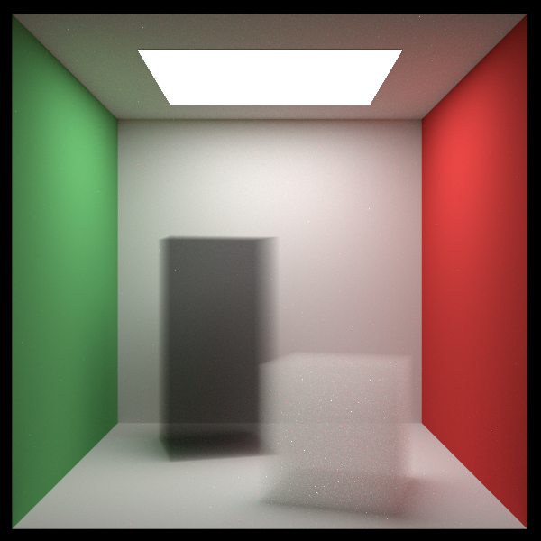

# Raytoy

Yet another ray tracer for learning

Thanks [Ray Tracing in One Weekend](https://raytracing.github.io/) for such great tutorial

## Prerequistes
* C++ compiler with support for the C++17 standard
* CMake, version 3.10 or higher

## Features

* Multi-threaded acceleration
* OBB(Oriented Bounding Box) support

## Example

**Checker Texture**

**Cornell Box**

**Cornell Box with blocks of smoke**

**Perlin noise & lights**

**All**

